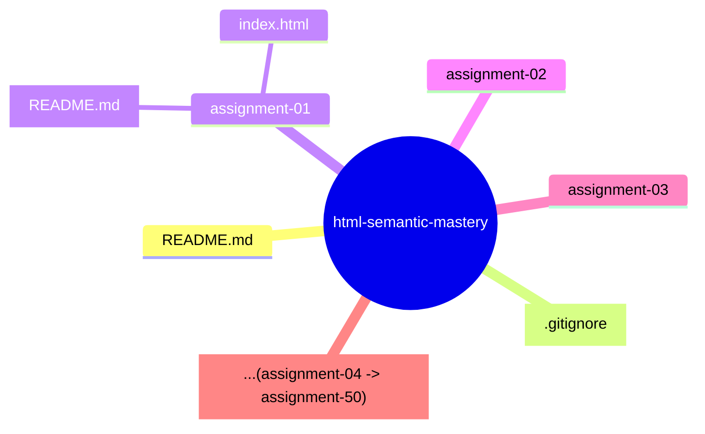

# HTML Semantic Mastery

A structured collection of **50 hands-on HTML5 Semantic labs** documenting my journey to mastering semantic markup, clean code organization, and Git & GitHub workflow.

---

## 📖 Overview

This repository contains a series of practical labs focused on learning and applying **HTML5 Semantic Elements**.

Each lab is designed to strengthen my understanding of semantic document structure while following professional software development practices, including:

- Writing clean and maintainable HTML
- Building accessible page structures
- Organizing project files consistently
- Managing source code with Git
- Documenting projects with Markdown

---

## 🎯 Learning Objectives

By completing this repository, I aim to:

- Understand HTML5 semantic elements and their purposes.
- Build meaningful and well-structured web pages.
- Improve accessibility through semantic markup.
- Develop a professional Git and GitHub workflow.
- Build a clean and maintainable frontend portfolio.

---

## 📂 Repository Structure

---

## 🗺️ Learning Roadmap

| Assignment |     Project      |     Status     | Link |
| :--------: | :--------------: | :------------: | :--: |
|     01     | The Ethos Coffee | 🚧 In Progress |  ⏳  |
|     02     |   Coming Soon    |       ⏳       |  ⏳  |
|     03     |   Coming Soon    |       ⏳       |  ⏳  |
|    ...     |       ...        |      ...       | ...  |
|     50     |   Coming Soon    |       ⏳       |  ⏳  |

---

## 💻 Technologies

   

---

## 🚀 Progress

- 
- **Current Lab:** Assignment 1 - The Ethos Coffee

---

## 👩‍💻 Author

**_Do Hai Minh An_ (Do Le Phuong)**
Frontend Labs Journey • HTML Semantic Mastery Series.

